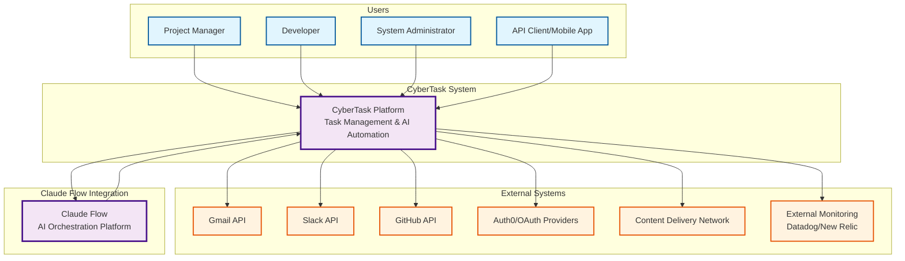
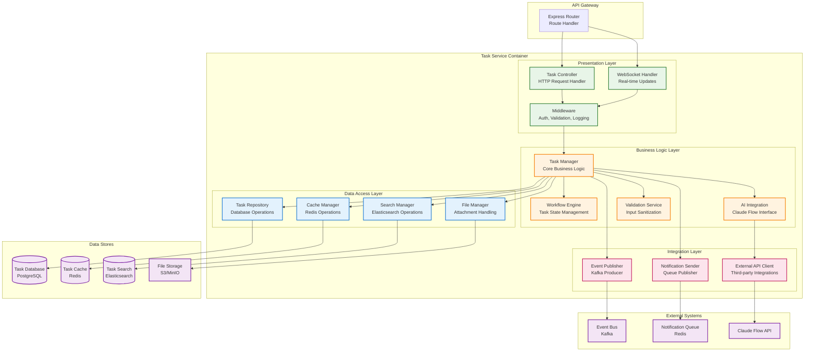
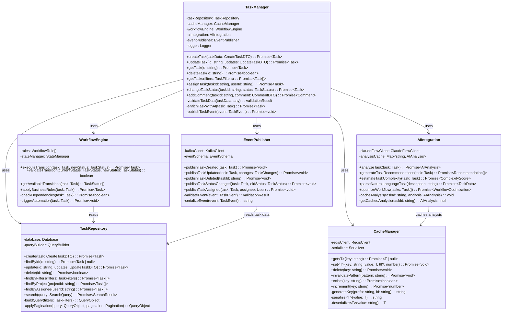
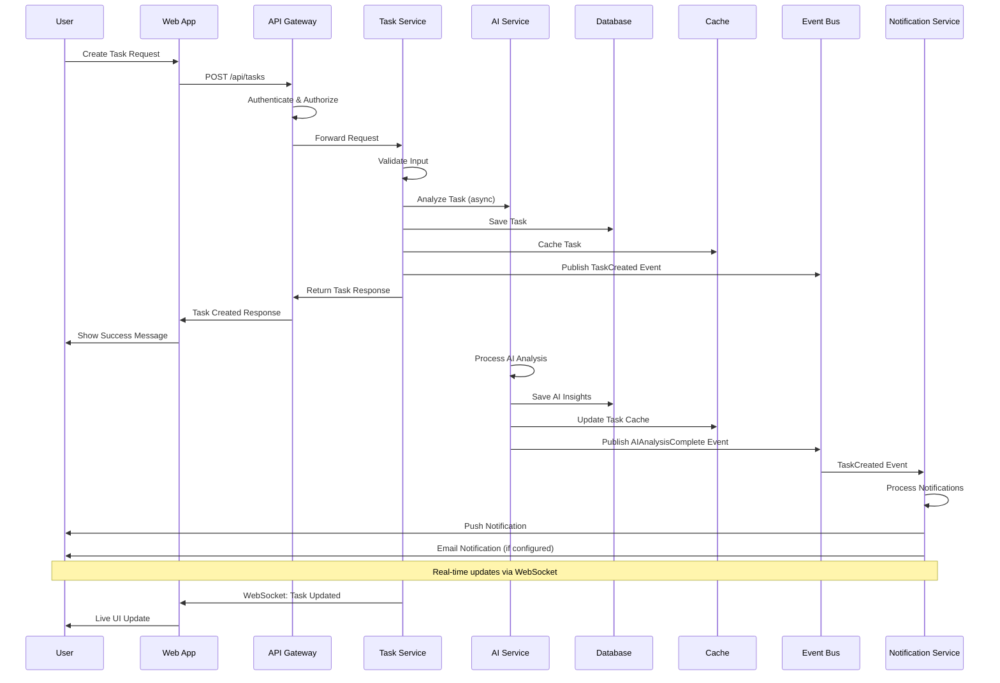

# CyberTask C4 Architecture Diagrams

## C4 Model Overview
The C4 model provides a hierarchical approach to software architecture diagramming, with four levels of abstraction: Context, Container, Component, and Code. These diagrams visualize CyberTask's architecture from high-level business context to detailed implementation.

## Level 1: System Context Diagram



### Context Description
- **CyberTask Platform**: The core system providing intelligent task management with AI-powered automation
- **Users**: Project managers, developers, and administrators accessing the platform via web and mobile interfaces
- **External Systems**: Third-party services for authentication, notifications, integrations, and monitoring
- **Claude Flow**: AI orchestration platform providing intelligent task analysis, workflow optimization, and natural language processing

## Level 2: Container Diagram

```mermaid
graph TB
    subgraph "User Devices"
        WebApp[Web Application<br/>React SPA]
        Mobile[Mobile App<br/>React Native]
        API_Tools[API Tools<br/>Postman/Custom]
    end

    subgraph "CyberTask Platform"
        subgraph "Frontend Layer"
            LB[Load Balancer<br/>NGINX/CloudFlare]
        end

        subgraph "Application Layer"
            Gateway[API Gateway<br/>Express.js]
            UserSvc[User Service<br/>Node.js/Express]
            TaskSvc[Task Service<br/>Node.js/Express]
            ProjectSvc[Project Service<br/>Node.js/Express]
            NotifSvc[Notification Service<br/>Node.js/Express]
            AnalyticsSvc[Analytics Service<br/>Node.js/Express]
            AISvc[AI Service<br/>Node.js/Claude Flow]
        end

        subgraph "Data Layer"
            MainDB[(Primary Database<br/>PostgreSQL)]
            CacheDB[(Cache Layer<br/>Redis Cluster)]
            SearchDB[(Search Engine<br/>Elasticsearch)]
            FileStore[File Storage<br/>S3/MinIO]
        end

        subgraph "Message Layer"
            EventBus[Event Bus<br/>Apache Kafka]
            Queue[Task Queue<br/>Redis/Bull]
        end

        subgraph "Infrastructure"
            Monitor[Monitoring<br/>Prometheus/Grafana]
            Logger[Logging<br/>ELK Stack]
        end
    end

    subgraph "External Services"
        OAuth[OAuth Providers<br/>Google/GitHub/MS]
        Email[Email Service<br/>SendGrid/SES]
        Push[Push Notifications<br/>Firebase/APNS]
        Claude[Claude Flow<br/>AI Platform]
    end

    %% User connections
    WebApp --> LB
    Mobile --> LB
    API_Tools --> LB

    %% Load balancer to gateway
    LB --> Gateway

    %% Gateway to services
    Gateway --> UserSvc
    Gateway --> TaskSvc
    Gateway --> ProjectSvc
    Gateway --> NotifSvc
    Gateway --> AnalyticsSvc
    Gateway --> AISvc

    %% Service to data connections
    UserSvc --> MainDB
    UserSvc --> CacheDB
    TaskSvc --> MainDB
    TaskSvc --> CacheDB
    TaskSvc --> SearchDB
    ProjectSvc --> MainDB
    ProjectSvc --> CacheDB
    NotifSvc --> CacheDB
    AnalyticsSvc --> MainDB
    AnalyticsSvc --> SearchDB
    AISvc --> MainDB
    AISvc --> CacheDB

    %% File storage connections
    TaskSvc --> FileStore
    ProjectSvc --> FileStore

    %% Event bus connections
    UserSvc --> EventBus
    TaskSvc --> EventBus
    ProjectSvc --> EventBus
    NotifSvc --> EventBus
    AnalyticsSvc --> EventBus
    AISvc --> EventBus

    %% Queue connections
    NotifSvc --> Queue
    AnalyticsSvc --> Queue
    AISvc --> Queue

    %% External service connections
    UserSvc --> OAuth
    NotifSvc --> Email
    NotifSvc --> Push
    AISvc --> Claude

    %% Infrastructure connections
    Gateway --> Monitor
    UserSvc --> Monitor
    TaskSvc --> Monitor
    ProjectSvc --> Monitor
    Gateway --> Logger
    UserSvc --> Logger
    TaskSvc --> Logger
    ProjectSvc --> Logger

    %% Styling
    classDef frontend fill:#e8f5e8,stroke:#2e7d32,stroke-width:2px
    classDef service fill:#fff3e0,stroke:#f57c00,stroke-width:2px
    classDef data fill:#e3f2fd,stroke:#1976d2,stroke-width:2px
    classDef external fill:#fce4ec,stroke:#c2185b,stroke-width:2px
    classDef infra fill:#f3e5f5,stroke:#7b1fa2,stroke-width:2px

    class WebApp,Mobile,API_Tools,LB frontend
    class Gateway,UserSvc,TaskSvc,ProjectSvc,NotifSvc,AnalyticsSvc,AISvc service
    class MainDB,CacheDB,SearchDB,FileStore,EventBus,Queue data
    class OAuth,Email,Push,Claude external
    class Monitor,Logger infra
```



### Container Technologies
- **Frontend**: React 18, TypeScript, Vite, Material-UI
- **API Gateway**: Express.js with Helmet, Rate Limiting, CORS
- **Microservices**: Node.js, Express.js, TypeScript
- **Databases**: PostgreSQL 14, Redis 7, Elasticsearch 8
- **Message Systems**: Apache Kafka, Redis/Bull queues
- **Infrastructure**: Prometheus, Grafana, ELK Stack

## Level 3: Component Diagram - Task Service



### Component Responsibilities

#### Presentation Layer
- **Task Controller**: HTTP request handling, response formatting, error handling
- **WebSocket Handler**: Real-time updates, collaborative editing, live notifications
- **Middleware**: Authentication, authorization, input validation, request logging

#### Business Logic Layer
- **Task Manager**: Core task operations, business rule enforcement, workflow coordination
- **Workflow Engine**: Task state transitions, dependency management, automation rules
- **AI Integration**: Claude Flow interface, intelligent task analysis, natural language processing
- **Validation Service**: Input sanitization, business rule validation, security checks

#### Data Access Layer
- **Task Repository**: Database CRUD operations, query optimization, transaction management
- **Cache Manager**: Redis operations, cache invalidation, performance optimization
- **Search Manager**: Elasticsearch operations, full-text search, indexing
- **File Manager**: Attachment handling, file upload/download, storage management

## Level 4: Code Diagram - Task Manager Class



### Class Relationships and Patterns

#### Design Patterns Used
1. **Repository Pattern**: TaskRepository abstracts data access
2. **Strategy Pattern**: WorkflowEngine uses configurable rules
3. **Observer Pattern**: EventPublisher notifies subscribers
4. **Cache-Aside Pattern**: CacheManager provides caching layer
5. **Facade Pattern**: TaskManager provides simplified interface

#### Key Interfaces
```typescript
interface TaskManager {
  createTask(taskData: CreateTaskDTO): Promise<Task>;
  updateTask(id: string, updates: UpdateTaskDTO): Promise<Task>;
  getTask(id: string): Promise<Task>;
  deleteTask(id: string): Promise<boolean>;
}

interface WorkflowEngine {
  executeTransition(task: Task, newStatus: TaskStatus): Promise<Task>;
  validateTransition(currentStatus: TaskStatus, newStatus: TaskStatus): boolean;
}

interface AIIntegration {
  analyzeTask(task: Task): Promise<AIAnalysis>;
  generateTaskRecommendations(task: Task): Promise<Recommendation[]>;
}
```

## Deployment Architecture Diagram

```mermaid
graph TB
    subgraph "Production Environment - AWS"
        subgraph "CDN Layer"
            CloudFront[CloudFront CDN<br/>Global Distribution]
        end

        subgraph "Load Balancing Layer"
            ALB[Application Load Balancer<br/>SSL Termination]
        end

        subgraph "Kubernetes Cluster - EKS"
            subgraph "Ingress"
                Istio[Istio Gateway<br/>Service Mesh]
            end

            subgraph "Application Pods"
                WebPod[Web App Pods<br/>3 replicas]
                APIPod[API Gateway Pods<br/>3 replicas]
                UserPod[User Service Pods<br/>2 replicas]
                TaskPod[Task Service Pods<br/>5 replicas]
                ProjectPod[Project Service Pods<br/>2 replicas]
                AIPod[AI Service Pods<br/>3 replicas]
            end

            subgraph "Infrastructure Pods"
                MonitorPod[Monitoring<br/>Prometheus/Grafana]
                LoggingPod[Logging<br/>Fluent Bit]
            end
        end

        subgraph "Data Layer"
            RDS[RDS PostgreSQL<br/>Multi-AZ Primary]
            RDSRead[RDS Read Replicas<br/>2 instances]
            ElastiCache[ElastiCache Redis<br/>Cluster Mode]
            ES[Elasticsearch Service<br/>3 node cluster]
        end

        subgraph "Storage Layer"
            S3Primary[S3 Primary Bucket<br/>Files & Backups]
            S3Logs[S3 Logs Bucket<br/>Access & App Logs]
        end

        subgraph "Message Layer"
            MSK[Amazon MSK<br/>Kafka Cluster]
        end
    end

    subgraph "External Services"
        Route53[Route53 DNS]
        SES[Simple Email Service]
        SNS[Simple Notification Service]
        Claude[Claude Flow API]
    end

    subgraph "Monitoring & Security"
        CloudWatch[CloudWatch<br/>Metrics & Alarms]
        GuardDuty[GuardDuty<br/>Threat Detection]
        WAF[Web Application Firewall]
        Secrets[AWS Secrets Manager]
    end

    %% Traffic flow
    Route53 --> CloudFront
    CloudFront --> WAF
    WAF --> ALB
    ALB --> Istio
    Istio --> WebPod
    Istio --> APIPod

    %% Service mesh routing
    APIPod --> UserPod
    APIPod --> TaskPod
    APIPod --> ProjectPod
    APIPod --> AIPod

    %% Data connections
    UserPod --> RDS
    TaskPod --> RDS
    TaskPod --> RDSRead
    ProjectPod --> RDS
    AIPod --> RDS

    %% Cache connections
    UserPod --> ElastiCache
    TaskPod --> ElastiCache
    ProjectPod --> ElastiCache
    AIPod --> ElastiCache

    %% Search connections
    TaskPod --> ES
    ProjectPod --> ES

    %% Storage connections
    TaskPod --> S3Primary
    ProjectPod --> S3Primary
    AIPod --> S3Primary

    %% Messaging
    TaskPod --> MSK
    ProjectPod --> MSK
    AIPod --> MSK

    %% External services
    UserPod --> SES
    TaskPod --> SNS
    AIPod --> Claude

    %% Monitoring
    MonitorPod --> CloudWatch
    LoggingPod --> S3Logs
    GuardDuty --> CloudWatch

    %% Secrets
    UserPod --> Secrets
    TaskPod --> Secrets
    AIPod --> Secrets

    %% Styling
    classDef cdn fill:#ff9800,color:#fff,stroke:#f57c00,stroke-width:2px
    classDef lb fill:#2196f3,color:#fff,stroke:#1976d2,stroke-width:2px
    classDef app fill:#4caf50,color:#fff,stroke:#388e3c,stroke-width:2px
    classDef data fill:#9c27b0,color:#fff,stroke:#7b1fa2,stroke-width:2px
    classDef external fill:#f44336,color:#fff,stroke:#d32f2f,stroke-width:2px
    classDef monitoring fill:#795548,color:#fff,stroke:#5d4037,stroke-width:2px

    class CloudFront,WAF cdn
    class ALB,Istio lb
    class WebPod,APIPod,UserPod,TaskPod,ProjectPod,AIPod app
    class RDS,RDSRead,ElastiCache,ES,S3Primary,S3Logs,MSK data
    class Route53,SES,SNS,Claude external
    class MonitorPod,LoggingPod,CloudWatch,GuardDuty,Secrets monitoring
```



## Data Flow Diagram



These C4 diagrams provide a comprehensive view of CyberTask's architecture at multiple levels of detail, from high-level system context to detailed code structure. They serve as living documentation for the development team and stakeholders to understand the system's design and evolution.