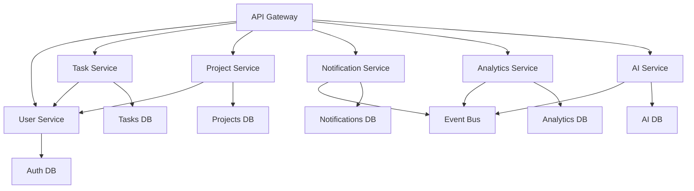

# CyberTask Microservices Architecture

## Service Boundaries and Responsibilities

### 1. User Service
**Port**: 3001  
**Database**: users_db  
**Responsibility**: User lifecycle management

#### Capabilities
- User registration and authentication
- Profile management and preferences
- Role-based access control (RBAC)
- OAuth integration (Google, GitHub, Microsoft)
- Password reset and security policies

#### APIs
- `POST /api/users/register`
- `POST /api/users/login`
- `GET /api/users/profile`
- `PUT /api/users/profile`
- `DELETE /api/users/account`

#### Events Published
- `UserCreated`
- `UserUpdated`
- `UserDeleted`
- `UserLoggedIn`

### 2. Task Service
**Port**: 3002  
**Database**: tasks_db  
**Responsibility**: Task lifecycle management

#### Capabilities
- Task CRUD operations
- Task status transitions
- Due date management
- Priority and difficulty scoring
- Task dependencies and relationships

#### APIs
- `POST /api/tasks`
- `GET /api/tasks/:id`
- `PUT /api/tasks/:id`
- `DELETE /api/tasks/:id`
- `PATCH /api/tasks/:id/status`

#### Events Published
- `TaskCreated`
- `TaskUpdated`
- `TaskCompleted`
- `TaskDeleted`
- `TaskStatusChanged`

### 3. Project Service
**Port**: 3003  
**Database**: projects_db  
**Responsibility**: Project and team management

#### Capabilities
- Project lifecycle management
- Team collaboration features
- Project templates and workflows
- Time tracking and reporting
- Resource allocation

#### APIs
- `POST /api/projects`
- `GET /api/projects/:id`
- `PUT /api/projects/:id`
- `DELETE /api/projects/:id`
- `POST /api/projects/:id/members`

#### Events Published
- `ProjectCreated`
- `ProjectUpdated`
- `ProjectDeleted`
- `MemberAdded`
- `MemberRemoved`

### 4. Notification Service
**Port**: 3004  
**Database**: notifications_db  
**Responsibility**: Real-time communication

#### Capabilities
- Push notifications
- Email notifications
- In-app messaging
- Webhook delivery
- Notification preferences

#### APIs
- `GET /api/notifications`
- `PUT /api/notifications/:id/read`
- `POST /api/notifications/preferences`
- `POST /api/webhooks`

#### Events Consumed
- All domain events for notification triggers

### 5. Analytics Service
**Port**: 3005  
**Database**: analytics_db (ClickHouse)  
**Responsibility**: Data analytics and reporting

#### Capabilities
- Usage metrics collection
- Performance dashboards
- Custom reports
- Data export capabilities
- Predictive analytics

#### APIs
- `GET /api/analytics/dashboard`
- `GET /api/analytics/reports`
- `POST /api/analytics/custom-query`
- `GET /api/analytics/exports`

### 6. AI Service (Claude Flow Integration)
**Port**: 3006  
**Database**: ai_db  
**Responsibility**: Intelligent automation

#### Capabilities
- Task prioritization using AI
- Natural language task creation
- Workflow optimization
- Resource prediction
- Anomaly detection

#### APIs
- `POST /api/ai/analyze-task`
- `POST /api/ai/optimize-workflow`
- `GET /api/ai/recommendations`
- `POST /api/ai/natural-language`

#### Events Published
- `AIAnalysisCompleted`
- `RecommendationGenerated`
- `AnomalyDetected`

## Communication Patterns

### Synchronous Communication
- **API Gateway → Services**: HTTP/REST for user-facing operations
- **Inter-service**: HTTP for immediate consistency requirements
- **Frontend → API Gateway**: REST + GraphQL federation

### Asynchronous Communication
- **Event Streaming**: Apache Kafka for domain events
- **Message Queues**: Redis for task queues
- **WebSockets**: Real-time notifications to frontend

### Data Consistency Patterns
- **Eventual Consistency**: For cross-service data synchronization
- **Saga Pattern**: For distributed transactions
- **Event Sourcing**: For audit trails and state reconstruction
- **CQRS**: Separate read/write models for analytics

## Service Dependencies

## Deployment Units

### Service Groups
1. **Core Services**: User, Task, Project (critical path)
2. **Support Services**: Notification, Analytics, AI (non-critical)
3. **Infrastructure**: Gateway, Event Bus, Monitoring

### Resource Requirements
- **CPU**: 2-4 cores per service
- **Memory**: 2-8 GB per service
- **Storage**: SSD with automated backups
- **Network**: Low latency for synchronous calls

## Scaling Strategies

### Horizontal Scaling
- **Stateless Services**: Auto-scale based on CPU/memory
- **Database Sharding**: By organization/tenant
- **Load Balancing**: Round-robin with health checks

### Caching Strategy
- **Redis Cluster**: Session data, frequently accessed data
- **CDN**: Static assets and API responses
- **Application Cache**: In-memory caching per service

## Circuit Breaker Pattern
Each service implements circuit breakers for:
- Database connections
- External API calls
- Inter-service communication
- Third-party integrations

## Health Check Strategy
- **Liveness Probe**: Service is running
- **Readiness Probe**: Service can handle traffic
- **Dependency Checks**: External services are available