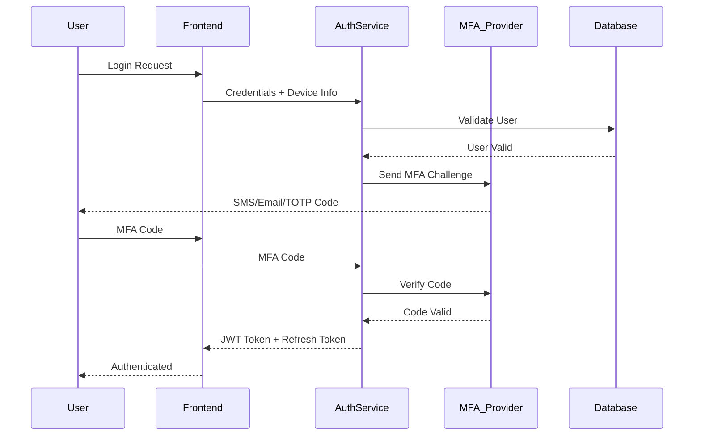

# CyberTask Security Architecture

## Security Overview
CyberTask implements a comprehensive security-first approach with defense-in-depth principles, zero-trust architecture, and compliance with industry standards including GDPR, SOC 2 Type II, and OWASP Top 10.

## Core Security Principles

### 1. Zero Trust Architecture
- **Never Trust, Always Verify**: Every request is authenticated and authorized
- **Least Privilege Access**: Minimum required permissions for each role
- **Continuous Verification**: Regular re-validation of trust levels
- **Micro-Segmentation**: Network and service isolation

### 2. Defense in Depth
- **Multiple Security Layers**: Redundant security controls
- **Fail-Safe Defaults**: Secure configurations by default
- **Security Monitoring**: Comprehensive logging and alerting
- **Incident Response**: Automated response to security events

## Authentication Architecture

### Multi-Factor Authentication (MFA)


### JWT Token Structure
```json
{
  "header": {
    "alg": "RS256",
    "typ": "JWT",
    "kid": "key-id-2025"
  },
  "payload": {
    "sub": "user-uuid",
    "iss": "cybertask.com",
    "aud": "cybertask-api",
    "exp": 1643723400,
    "iat": 1643719800,
    "nbf": 1643719800,
    "jti": "token-uuid",
    "scope": "read:tasks write:tasks read:projects",
    "org_id": "org-uuid",
    "roles": ["developer", "project_member"],
    "permissions": [
      "tasks.create",
      "tasks.read",
      "tasks.update",
      "projects.read"
    ],
    "device_id": "device-uuid",
    "ip_address": "192.168.1.100",
    "session_id": "session-uuid"
  },
  "signature": "RSA-256-signature"
}
```

### OAuth 2.0 Integration
```typescript
// OAuth Configuration
const oauthConfig = {
  providers: {
    google: {
      clientId: process.env.GOOGLE_CLIENT_ID,
      clientSecret: process.env.GOOGLE_CLIENT_SECRET,
      scope: ['openid', 'email', 'profile'],
      redirectUri: `${process.env.BASE_URL}/auth/oauth/google/callback`
    },
    github: {
      clientId: process.env.GITHUB_CLIENT_ID,
      clientSecret: process.env.GITHUB_CLIENT_SECRET,
      scope: ['user:email', 'read:user'],
      redirectUri: `${process.env.BASE_URL}/auth/oauth/github/callback`
    },
    microsoft: {
      clientId: process.env.MICROSOFT_CLIENT_ID,
      clientSecret: process.env.MICROSOFT_CLIENT_SECRET,
      scope: ['openid', 'email', 'profile'],
      redirectUri: `${process.env.BASE_URL}/auth/oauth/microsoft/callback`
    }
  }
};

// OAuth Flow Implementation
class OAuthService {
  async initiateOAuth(provider: string, state: string): Promise<string> {
    const config = oauthConfig.providers[provider];
    const params = new URLSearchParams({
      response_type: 'code',
      client_id: config.clientId,
      redirect_uri: config.redirectUri,
      scope: config.scope.join(' '),
      state: this.encryptState(state), // Prevent CSRF
      nonce: this.generateNonce()      // Prevent replay attacks
    });
    
    return `${this.getAuthUrl(provider)}?${params.toString()}`;
  }

  async handleCallback(
    provider: string,
    code: string,
    state: string
  ): Promise<AuthResult> {
    // Verify state parameter
    if (!this.verifyState(state)) {
      throw new SecurityError('Invalid state parameter');
    }

    // Exchange code for token
    const tokens = await this.exchangeCodeForTokens(provider, code);
    
    // Get user info
    const userInfo = await this.getUserInfo(provider, tokens.accessToken);
    
    // Create or update user
    const user = await this.createOrUpdateUser(userInfo, provider);
    
    // Generate JWT
    const jwt = await this.generateJWT(user);
    
    return {
      accessToken: jwt.accessToken,
      refreshToken: jwt.refreshToken,
      user: user
    };
  }
}
```

## Authorization Framework

### Role-Based Access Control (RBAC)
```typescript
interface Role {
  id: string;
  name: string;
  description: string;
  permissions: Permission[];
  organizationId?: string; // Organization-specific roles
}

interface Permission {
  id: string;
  resource: string;    // 'tasks', 'projects', 'users'
  action: string;      // 'create', 'read', 'update', 'delete'
  conditions?: {       // Conditional permissions
    own?: boolean;     // Only own resources
    status?: string;   // Only certain statuses
    field?: string;    // Specific fields only
  };
}

// Example roles and permissions
const roles: Role[] = [
  {
    id: 'admin',
    name: 'System Administrator',
    description: 'Full system access',
    permissions: [
      { id: '1', resource: '*', action: '*' }
    ]
  },
  {
    id: 'org_owner',
    name: 'Organization Owner',
    description: 'Full organization access',
    permissions: [
      { id: '2', resource: 'organization', action: '*' },
      { id: '3', resource: 'projects', action: '*' },
      { id: '4', resource: 'tasks', action: '*' },
      { id: '5', resource: 'users', action: 'read' }
    ]
  },
  {
    id: 'developer',
    name: 'Developer',
    description: 'Task and project management',
    permissions: [
      { id: '6', resource: 'tasks', action: 'create' },
      { id: '7', resource: 'tasks', action: 'read' },
      { id: '8', resource: 'tasks', action: 'update', conditions: { own: true } },
      { id: '9', resource: 'projects', action: 'read' }
    ]
  }
];
```

### Policy Engine
```typescript
class PolicyEngine {
  async evaluatePermission(
    user: User,
    resource: string,
    action: string,
    context: any = {}
  ): Promise<boolean> {
    // Get user roles and permissions
    const userPermissions = await this.getUserPermissions(user.id);
    
    // Check direct permissions
    const hasDirectPermission = userPermissions.some(permission => 
      this.matchesPermission(permission, resource, action, context)
    );
    
    if (hasDirectPermission) {
      // Apply conditions
      return this.evaluateConditions(userPermissions, resource, action, context);
    }
    
    // Check inherited permissions
    const hasInheritedPermission = await this.checkInheritedPermissions(
      user, resource, action, context
    );
    
    // Log authorization decision
    await this.logAuthorizationDecision({
      userId: user.id,
      resource,
      action,
      decision: hasDirectPermission || hasInheritedPermission,
      timestamp: new Date(),
      context
    });
    
    return hasDirectPermission || hasInheritedPermission;
  }

  private matchesPermission(
    permission: Permission,
    resource: string,
    action: string,
    context: any
  ): boolean {
    // Wildcard matching
    if (permission.resource === '*' || permission.action === '*') {
      return true;
    }
    
    // Exact matching
    if (permission.resource === resource && permission.action === action) {
      return true;
    }
    
    // Pattern matching (e.g., 'tasks:*', 'users:read')
    const resourcePattern = new RegExp(permission.resource.replace('*', '.*'));
    const actionPattern = new RegExp(permission.action.replace('*', '.*'));
    
    return resourcePattern.test(resource) && actionPattern.test(action);
  }

  private evaluateConditions(
    permissions: Permission[],
    resource: string,
    action: string,
    context: any
  ): boolean {
    const applicablePermissions = permissions.filter(p => 
      this.matchesPermission(p, resource, action, context)
    );
    
    for (const permission of applicablePermissions) {
      if (!permission.conditions) {
        return true; // No conditions, allow
      }
      
      // Check 'own' condition
      if (permission.conditions.own && context.userId !== context.resourceOwnerId) {
        continue;
      }
      
      // Check status condition
      if (permission.conditions.status && 
          context.resourceStatus !== permission.conditions.status) {
        continue;
      }
      
      // Check field-level permission
      if (permission.conditions.field && 
          !context.fields?.includes(permission.conditions.field)) {
        continue;
      }
      
      return true; // All conditions met
    }
    
    return false; // No permissions with satisfied conditions
  }
}
```

### API Authorization Middleware
```typescript
const authorizeEndpoint = (resource: string, action: string) => {
  return async (req: AuthenticatedRequest, res: Response, next: NextFunction) => {
    try {
      // Extract user from JWT
      const user = req.user;
      
      // Build context from request
      const context = {
        userId: user.id,
        organizationId: req.headers['x-organization-id'],
        resourceId: req.params.id,
        resourceOwnerId: null, // Will be populated if needed
        method: req.method,
        path: req.path,
        ip: req.ip,
        userAgent: req.headers['user-agent']
      };
      
      // For resource-specific permissions, fetch resource owner
      if (context.resourceId) {
        const resourceOwner = await this.getResourceOwner(resource, context.resourceId);
        context.resourceOwnerId = resourceOwner?.id;
      }
      
      // Evaluate permission
      const hasPermission = await policyEngine.evaluatePermission(
        user, resource, action, context
      );
      
      if (!hasPermission) {
        return res.status(403).json({
          errors: [{
            status: '403',
            code: 'INSUFFICIENT_PERMISSIONS',
            title: 'Insufficient permissions',
            detail: `You don't have permission to ${action} ${resource}`
          }]
        });
      }
      
      // Add authorization context to request
      req.authContext = context;
      next();
      
    } catch (error) {
      logger.error('Authorization error:', error);
      res.status(500).json({
        errors: [{
          status: '500',
          code: 'AUTHORIZATION_ERROR',
          title: 'Authorization error',
          detail: 'An error occurred while checking permissions'
        }]
      });
    }
  };
};

// Usage in routes
app.get('/api/tasks/:id', 
  authenticateToken,
  authorizeEndpoint('tasks', 'read'),
  getTask
);

app.put('/api/tasks/:id',
  authenticateToken,
  authorizeEndpoint('tasks', 'update'),
  updateTask
);
```

## Data Protection

### Encryption at Rest
```typescript
class EncryptionService {
  private readonly algorithm = 'aes-256-gcm';
  private readonly keyDerivation = 'pbkdf2';
  
  // Application-level encryption for sensitive fields
  async encryptSensitiveField(data: string, context: string): Promise<EncryptedField> {
    const key = await this.deriveKey(context);
    const iv = crypto.randomBytes(16);
    
    const cipher = crypto.createCipher(this.algorithm, key);
    cipher.setAAD(Buffer.from(context)); // Additional authenticated data
    
    let encrypted = cipher.update(data, 'utf8', 'hex');
    encrypted += cipher.final('hex');
    
    const authTag = cipher.getAuthTag();
    
    return {
      data: encrypted,
      iv: iv.toString('hex'),
      authTag: authTag.toString('hex'),
      algorithm: this.algorithm,
      context: context
    };
  }
  
  async decryptSensitiveField(encrypted: EncryptedField): Promise<string> {
    const key = await this.deriveKey(encrypted.context);
    const iv = Buffer.from(encrypted.iv, 'hex');
    const authTag = Buffer.from(encrypted.authTag, 'hex');
    
    const decipher = crypto.createDecipher(this.algorithm, key);
    decipher.setAAD(Buffer.from(encrypted.context));
    decipher.setAuthTag(authTag);
    
    let decrypted = decipher.update(encrypted.data, 'hex', 'utf8');
    decrypted += decipher.final('utf8');
    
    return decrypted;
  }
  
  private async deriveKey(context: string): Promise<Buffer> {
    const masterKey = process.env.MASTER_ENCRYPTION_KEY;
    const salt = Buffer.from(context);
    
    return crypto.pbkdf2Sync(masterKey, salt, 100000, 32, 'sha512');
  }
}

// Database encryption configuration
const dbConfig = {
  // PostgreSQL TDE (Transparent Data Encryption)
  encryption: {
    enabled: true,
    algorithm: 'AES-256-XTS',
    keyManagement: 'AWS KMS', // or 'Azure Key Vault', 'HashiCorp Vault'
  },
  
  // Column-level encryption for PII
  columnEncryption: {
    'users.email': 'deterministic', // Allows equality searches
    'users.phone': 'randomized',    // High security, no searches
    'attachments.content': 'randomized',
    'comments.content': 'searchable' // Allows full-text search
  }
};
```

### Encryption in Transit
```typescript
// TLS Configuration
const tlsConfig = {
  // Minimum TLS version
  secureProtocol: 'TLSv1_3_method',
  
  // Cipher suites (strong ciphers only)
  ciphers: [
    'TLS_AES_256_GCM_SHA384',
    'TLS_CHACHA20_POLY1305_SHA256',
    'TLS_AES_128_GCM_SHA256',
    'ECDHE-RSA-AES256-GCM-SHA384',
    'ECDHE-RSA-CHACHA20-POLY1305',
    'ECDHE-RSA-AES128-GCM-SHA256'
  ].join(':'),
  
  // HSTS (HTTP Strict Transport Security)
  hsts: {
    maxAge: 31536000, // 1 year
    includeSubDomains: true,
    preload: true
  },
  
  // Certificate pinning
  certificatePinning: {
    enabled: true,
    pins: [
      'sha256/primary-cert-hash',
      'sha256/backup-cert-hash'
    ],
    reportUri: '/api/security/cert-pin-report'
  }
};

// Express.js security middleware
app.use(helmet({
  contentSecurityPolicy: {
    directives: {
      defaultSrc: ["'self'"],
      styleSrc: ["'self'", "'unsafe-inline'", "https://fonts.googleapis.com"],
      fontSrc: ["'self'", "https://fonts.gstatic.com"],
      imgSrc: ["'self'", "data:", "https:"],
      scriptSrc: ["'self'"],
      connectSrc: ["'self'", "wss:", "https:"],
      frameSrc: ["'none'"],
      objectSrc: ["'none'"],
      baseUri: ["'self'"],
      formAction: ["'self'"],
      upgradeInsecureRequests: []
    }
  },
  hsts: tlsConfig.hsts,
  noSniff: true,
  xssFilter: true,
  referrerPolicy: { policy: 'strict-origin-when-cross-origin' }
}));
```

## Input Validation and Sanitization

### Schema Validation
```typescript
import { z } from 'zod';

// Input validation schemas
const createTaskSchema = z.object({
  title: z.string()
    .min(1, 'Title is required')
    .max(500, 'Title must be less than 500 characters')
    .regex(/^[a-zA-Z0-9\s\-_.,!?]+$/, 'Title contains invalid characters'),
  
  description: z.string()
    .max(10000, 'Description too long')
    .optional()
    .transform((val) => val ? sanitizeHtml(val) : undefined),
  
  priority: z.enum(['low', 'medium', 'high', 'urgent']),
  
  dueDate: z.string()
    .datetime()
    .refine((date) => new Date(date) > new Date(), 'Due date must be in the future')
    .optional(),
  
  assigneeId: z.string()
    .uuid()
    .optional()
    .refine(async (id) => {
      if (!id) return true;
      const user = await User.findById(id);
      return !!user;
    }, 'Invalid assignee'),
  
  labels: z.array(z.string().max(50))
    .max(10, 'Too many labels')
    .optional(),
  
  estimatedHours: z.number()
    .min(0.1)
    .max(1000)
    .optional()
});

// Validation middleware
const validateRequest = (schema: z.ZodSchema) => {
  return async (req: Request, res: Response, next: NextFunction) => {
    try {
      // Validate and sanitize request body
      req.body = await schema.parseAsync(req.body);
      next();
    } catch (error) {
      if (error instanceof z.ZodError) {
        return res.status(422).json({
          errors: error.errors.map(err => ({
            status: '422',
            code: 'VALIDATION_ERROR',
            title: 'Validation failed',
            detail: err.message,
            source: { pointer: `/data/attributes/${err.path.join('/')}` }
          }))
        });
      }
      next(error);
    }
  };
};

// Usage
app.post('/api/tasks',
  authenticateToken,
  authorizeEndpoint('tasks', 'create'),
  validateRequest(createTaskSchema),
  createTask
);
```

### SQL Injection Prevention
```typescript
// Using parameterized queries with TypeORM
class TaskRepository {
  async findTasksByUser(userId: string, filters: TaskFilters): Promise<Task[]> {
    const query = this.taskRepository
      .createQueryBuilder('task')
      .leftJoinAndSelect('task.project', 'project')
      .leftJoinAndSelect('task.assignee', 'assignee')
      .where('task.projectId IN (SELECT p.id FROM projects p WHERE p.organizationId = :orgId)', {
        orgId: filters.organizationId
      });
    
    // Safe parameter binding
    if (filters.status) {
      query.andWhere('task.status = :status', { status: filters.status });
    }
    
    if (filters.assigneeId) {
      query.andWhere('task.assigneeId = :assigneeId', { assigneeId: filters.assigneeId });
    }
    
    if (filters.search) {
      // Use full-text search vector, not LIKE with user input
      query.andWhere(
        'task.searchVector @@ plainto_tsquery(:search)',
        { search: filters.search }
      );
    }
    
    // Safe ordering
    const allowedSortFields = ['createdAt', 'updatedAt', 'title', 'priority', 'dueDate'];
    if (filters.sortBy && allowedSortFields.includes(filters.sortBy)) {
      query.orderBy(`task.${filters.sortBy}`, filters.sortDirection || 'ASC');
    }
    
    return query.getMany();
  }
}
```

## API Security

### Rate Limiting
```typescript
import rateLimit from 'express-rate-limit';
import RedisStore from 'rate-limit-redis';

// Multiple rate limiting strategies
const rateLimiters = {
  // Global rate limit
  global: rateLimit({
    store: new RedisStore({
      client: redisClient,
      prefix: 'rl:global:'
    }),
    windowMs: 15 * 60 * 1000, // 15 minutes
    max: 1000, // requests per window per IP
    message: {
      errors: [{
        status: '429',
        code: 'RATE_LIMIT_EXCEEDED',
        title: 'Too many requests',
        detail: 'You have exceeded the rate limit. Try again later.'
      }]
    },
    standardHeaders: true,
    legacyHeaders: false
  }),
  
  // Authentication endpoints (stricter)
  auth: rateLimit({
    store: new RedisStore({
      client: redisClient,
      prefix: 'rl:auth:'
    }),
    windowMs: 15 * 60 * 1000,
    max: 5, // Only 5 login attempts per 15 minutes
    skipSuccessfulRequests: true,
    keyGenerator: (req) => `${req.ip}:${req.body?.email || 'unknown'}`
  }),
  
  // API endpoints (per user)
  api: rateLimit({
    store: new RedisStore({
      client: redisClient,
      prefix: 'rl:api:'
    }),
    windowMs: 60 * 60 * 1000, // 1 hour
    max: 10000, // requests per hour per user
    keyGenerator: (req) => req.user?.id || req.ip,
    skip: (req) => !req.user // Skip for unauthenticated requests
  }),
  
  // Heavy operations (slower rate limit)
  heavy: rateLimit({
    store: new RedisStore({
      client: redisClient,
      prefix: 'rl:heavy:'
    }),
    windowMs: 60 * 1000, // 1 minute
    max: 10, // Only 10 heavy operations per minute
    keyGenerator: (req) => req.user?.id || req.ip
  })
};

// Apply rate limiters
app.use('/api', rateLimiters.global, rateLimiters.api);
app.use('/api/auth', rateLimiters.auth);
app.use('/api/export', rateLimiters.heavy);
app.use('/api/ai', rateLimiters.heavy);
```

### CORS Configuration
```typescript
const corsOptions = {
  origin: (origin: string | undefined, callback: Function) => {
    // Allow requests from allowed origins
    const allowedOrigins = [
      'https://app.cybertask.com',
      'https://staging.cybertask.com',
      ...(process.env.NODE_ENV === 'development' ? ['http://localhost:3000'] : [])
    ];
    
    if (!origin || allowedOrigins.includes(origin)) {
      callback(null, true);
    } else {
      callback(new Error('Not allowed by CORS'));
    }
  },
  credentials: true,
  optionsSuccessStatus: 200,
  methods: ['GET', 'POST', 'PUT', 'PATCH', 'DELETE', 'OPTIONS'],
  allowedHeaders: [
    'Origin',
    'X-Requested-With',
    'Content-Type',
    'Accept',
    'Authorization',
    'X-Organization-ID',
    'X-Request-ID'
  ],
  maxAge: 86400 // 24 hours
};

app.use(cors(corsOptions));
```

## Security Monitoring and Incident Response

### Security Event Logging
```typescript
class SecurityLogger {
  private logger = winston.createLogger({
    level: 'info',
    format: winston.format.combine(
      winston.format.timestamp(),
      winston.format.errors({ stack: true }),
      winston.format.json()
    ),
    defaultMeta: { service: 'cybertask-security' },
    transports: [
      new winston.transports.File({ filename: 'logs/security-error.log', level: 'error' }),
      new winston.transports.File({ filename: 'logs/security-audit.log' }),
      // Send to SIEM system
      new winston.transports.Http({
        host: 'siem.cybertask.com',
        port: 443,
        path: '/api/logs'
      })
    ]
  });

  logAuthenticationAttempt(event: AuthenticationEvent) {
    this.logger.info('authentication_attempt', {
      event_type: 'authentication',
      user_id: event.userId,
      user_email: event.email,
      ip_address: event.ipAddress,
      user_agent: event.userAgent,
      success: event.success,
      failure_reason: event.failureReason,
      timestamp: event.timestamp,
      risk_score: this.calculateRiskScore(event)
    });

    // Trigger alerts for suspicious activity
    if (event.riskScore > 0.8) {
      this.triggerSecurityAlert('high_risk_authentication', event);
    }
  }

  logAuthorizationFailure(event: AuthorizationEvent) {
    this.logger.warn('authorization_failure', {
      event_type: 'authorization',
      user_id: event.userId,
      resource: event.resource,
      action: event.action,
      ip_address: event.ipAddress,
      timestamp: event.timestamp,
      context: event.context
    });

    // Track potential privilege escalation attempts
    if (this.isPotentialEscalation(event)) {
      this.triggerSecurityAlert('privilege_escalation_attempt', event);
    }
  }

  logDataAccess(event: DataAccessEvent) {
    this.logger.info('data_access', {
      event_type: 'data_access',
      user_id: event.userId,
      resource_type: event.resourceType,
      resource_id: event.resourceId,
      action: event.action,
      sensitive_data: event.containsSensitiveData,
      ip_address: event.ipAddress,
      timestamp: event.timestamp
    });
  }

  private calculateRiskScore(event: AuthenticationEvent): number {
    let score = 0;

    // Location-based risk
    if (event.isFromUnknownLocation) score += 0.3;
    if (event.isFromHighRiskCountry) score += 0.2;

    // Device-based risk
    if (event.isFromNewDevice) score += 0.2;
    if (event.deviceFingerprint.isInconsistent) score += 0.3;

    // Behavioral risk
    if (event.timeSinceLastLogin > 30 * 24 * 60 * 60 * 1000) score += 0.2; // 30 days
    if (event.failedAttemptsRecent > 3) score += 0.4;

    return Math.min(score, 1.0);
  }

  private triggerSecurityAlert(alertType: string, event: any) {
    // Send to security team via multiple channels
    this.sendAlert({
      type: alertType,
      severity: 'high',
      event: event,
      timestamp: new Date(),
      channels: ['slack', 'email', 'pagerduty']
    });
  }
}
```

### Automated Security Response
```typescript
class IncidentResponseSystem {
  async handleSecurityIncident(incident: SecurityIncident) {
    const response = await this.evaluateIncident(incident);
    
    switch (response.severity) {
      case 'critical':
        await this.executeCriticalResponse(incident);
        break;
      case 'high':
        await this.executeHighSeverityResponse(incident);
        break;
      case 'medium':
        await this.executeMediumSeverityResponse(incident);
        break;
      default:
        await this.executeStandardResponse(incident);
    }
  }

  private async executeCriticalResponse(incident: SecurityIncident) {
    // Immediate containment
    await this.lockUserAccount(incident.userId);
    await this.revokeAllUserSessions(incident.userId);
    await this.blockIpAddress(incident.ipAddress);
    
    // Alert security team
    await this.alertSecurityTeam(incident, 'critical');
    
    // Preserve evidence
    await this.preserveSecurityLogs(incident);
    
    // Notify compliance team
    await this.notifyCompliance(incident);
  }

  private async executeHighSeverityResponse(incident: SecurityIncident) {
    // Temporary account restrictions
    await this.enableAccountRestrictions(incident.userId);
    await this.requireMFAForUser(incident.userId);
    
    // Enhanced monitoring
    await this.enableEnhancedMonitoring(incident.userId, 24 * 60 * 60 * 1000); // 24 hours
    
    // Security team notification
    await this.alertSecurityTeam(incident, 'high');
  }

  private async lockUserAccount(userId: string) {
    await User.update(userId, { 
      locked: true,
      lockReason: 'Security incident - automatic lock',
      lockedAt: new Date()
    });
    
    // Revoke all active sessions
    await this.revokeAllUserSessions(userId);
  }

  private async revokeAllUserSessions(userId: string) {
    // Add tokens to blacklist
    const activeSessions = await Session.findByUserId(userId);
    for (const session of activeSessions) {
      await redis.setex(`blacklist:${session.tokenId}`, 3600 * 24, 'revoked');
    }
    
    // Delete session records
    await Session.deleteByUserId(userId);
  }

  private async blockIpAddress(ipAddress: string, duration: number = 3600) {
    await redis.setex(`blocked_ip:${ipAddress}`, duration, JSON.stringify({
      blocked_at: new Date(),
      reason: 'Security incident - automatic block',
      duration: duration
    }));
  }
}
```

## Compliance and Privacy

### GDPR Compliance
```typescript
class GDPRService {
  async handleDataSubjectRequest(request: DataSubjectRequest): Promise<void> {
    switch (request.type) {
      case 'access':
        await this.handleAccessRequest(request);
        break;
      case 'rectification':
        await this.handleRectificationRequest(request);
        break;
      case 'erasure':
        await this.handleErasureRequest(request);
        break;
      case 'portability':
        await this.handlePortabilityRequest(request);
        break;
      case 'restriction':
        await this.handleRestrictionRequest(request);
        break;
    }
  }

  private async handleAccessRequest(request: DataSubjectRequest): Promise<void> {
    const userId = request.userId;
    
    // Collect all personal data
    const userData = {
      profile: await User.findById(userId),
      tasks: await Task.findByUserId(userId),
      projects: await Project.findByUserId(userId),
      comments: await Comment.findByUserId(userId),
      timeEntries: await TimeEntry.findByUserId(userId),
      notifications: await Notification.findByUserId(userId),
      activityLogs: await ActivityLog.findByUserId(userId, { 
        limit: 1000, 
        orderBy: 'created_at DESC' 
      }),
      oauthProviders: await OAuthProvider.findByUserId(userId),
      sessions: await Session.findByUserId(userId, { active: false }),
      auditLogs: await AuditLog.findBySubject(userId)
    };

    // Remove sensitive fields
    const sanitizedData = this.sanitizePersonalData(userData);
    
    // Generate report
    const report = await this.generateGDPRReport(sanitizedData, request);
    
    // Deliver securely
    await this.deliverGDPRReport(request.email, report);
    
    // Log the request
    await this.logGDPRRequest(request, 'completed');
  }

  private async handleErasureRequest(request: DataSubjectRequest): Promise<void> {
    const userId = request.userId;
    
    // Check for legal basis to retain data
    if (await this.hasLegalBasisToRetain(userId)) {
      await this.logGDPRRequest(request, 'rejected', 'Legal basis to retain data');
      return;
    }

    // Anonymize data instead of deletion where business needs exist
    await this.anonymizeUserData(userId);
    
    // Delete personal identifiers
    await this.deletePersonalIdentifiers(userId);
    
    // Update data retention policies
    await this.updateDataRetentionPolicy(userId);
    
    await this.logGDPRRequest(request, 'completed');
  }

  private async anonymizeUserData(userId: string): Promise<void> {
    const anonymizedId = `anon_${crypto.randomUUID()}`;
    
    // Anonymize user profile
    await User.update(userId, {
      email: `${anonymizedId}@anonymized.local`,
      firstName: 'Anonymized',
      lastName: 'User',
      avatarUrl: null,
      deletedAt: new Date()
    });

    // Anonymize comments and activity
    await Comment.updateByUserId(userId, {
      content: '[Content removed per user request]',
      userDisplayName: 'Anonymous User'
    });

    // Keep aggregated analytics but remove personal identifiers
    await AnalyticsEvent.updateByUserId(userId, {
      userId: anonymizedId,
      personalIdentifiers: null
    });
  }
}
```

### Data Retention Policies
```typescript
class DataRetentionService {
  private retentionPolicies = {
    user_sessions: 30, // days
    activity_logs: 365, // days
    audit_logs: 2555, // 7 years for compliance
    deleted_users: 30, // days before complete purge
    temporary_files: 7, // days
    error_logs: 90, // days
    performance_metrics: 365 // days
  };

  async enforceRetentionPolicies(): Promise<void> {
    for (const [dataType, retentionDays] of Object.entries(this.retentionPolicies)) {
      await this.purgeExpiredData(dataType, retentionDays);
    }
  }

  private async purgeExpiredData(dataType: string, retentionDays: number): Promise<void> {
    const cutoffDate = new Date();
    cutoffDate.setDate(cutoffDate.getDate() - retentionDays);

    let purgedCount = 0;

    switch (dataType) {
      case 'user_sessions':
        purgedCount = await Session.deleteExpired(cutoffDate);
        break;
      case 'activity_logs':
        purgedCount = await ActivityLog.deleteOlderThan(cutoffDate);
        break;
      case 'audit_logs':
        // Archive instead of delete for compliance
        purgedCount = await AuditLog.archiveOlderThan(cutoffDate);
        break;
      case 'deleted_users':
        purgedCount = await User.purgeDeleted(cutoffDate);
        break;
    }

    logger.info(`Data retention: purged ${purgedCount} records of type ${dataType}`);
  }
}
```

## Security Testing

### Security Test Suite
```typescript
describe('Security Tests', () => {
  describe('Authentication', () => {
    it('should reject weak passwords', async () => {
      const weakPasswords = [
        'password',
        '123456',
        'qwerty',
        'abc123',
        'password123'
      ];

      for (const password of weakPasswords) {
        const response = await request(app)
          .post('/api/auth/register')
          .send({
            email: 'test@example.com',
            password: password,
            confirmPassword: password
          });

        expect(response.status).toBe(422);
        expect(response.body.errors).toContainEqual(
          expect.objectContaining({
            code: 'WEAK_PASSWORD'
          })
        );
      }
    });

    it('should enforce rate limiting on login attempts', async () => {
      const credentials = {
        email: 'test@example.com',
        password: 'wrongpassword'
      };

      // Make 6 failed attempts (limit is 5)
      for (let i = 0; i < 6; i++) {
        await request(app)
          .post('/api/auth/login')
          .send(credentials);
      }

      const response = await request(app)
        .post('/api/auth/login')
        .send(credentials);

      expect(response.status).toBe(429);
      expect(response.body.errors[0].code).toBe('RATE_LIMIT_EXCEEDED');
    });
  });

  describe('Authorization', () => {
    it('should prevent access to other users\' tasks', async () => {
      const user1Token = await getAuthToken('user1@example.com');
      const user2Token = await getAuthToken('user2@example.com');

      // Create task as user1
      const createResponse = await request(app)
        .post('/api/tasks')
        .set('Authorization', `Bearer ${user1Token}`)
        .send({
          title: 'User 1 Task',
          projectId: 'project-1'
        });

      const taskId = createResponse.body.data.id;

      // Try to access as user2
      const accessResponse = await request(app)
        .get(`/api/tasks/${taskId}`)
        .set('Authorization', `Bearer ${user2Token}`);

      expect(accessResponse.status).toBe(403);
    });
  });

  describe('Input Validation', () => {
    it('should prevent SQL injection', async () => {
      const token = await getAuthToken('user@example.com');
      const maliciousInput = "'; DROP TABLE users; --";

      const response = await request(app)
        .get('/api/tasks')
        .set('Authorization', `Bearer ${token}`)
        .query({ search: maliciousInput });

      // Should not cause database error
      expect(response.status).not.toBe(500);
      
      // Check that users table still exists
      const usersCount = await User.count();
      expect(usersCount).toBeGreaterThan(0);
    });

    it('should prevent XSS in task descriptions', async () => {
      const token = await getAuthToken('user@example.com');
      const xssPayload = '<script>alert("XSS")</script>';

      const response = await request(app)
        .post('/api/tasks')
        .set('Authorization', `Bearer ${token}`)
        .send({
          title: 'Test Task',
          description: xssPayload,
          projectId: 'project-1'
        });

      expect(response.status).toBe(201);
      expect(response.body.data.attributes.description).not.toContain('<script>');
    });
  });
});
```

This comprehensive security architecture provides multiple layers of protection, compliance with industry standards, and robust monitoring capabilities to ensure CyberTask maintains the highest security standards for enterprise users.